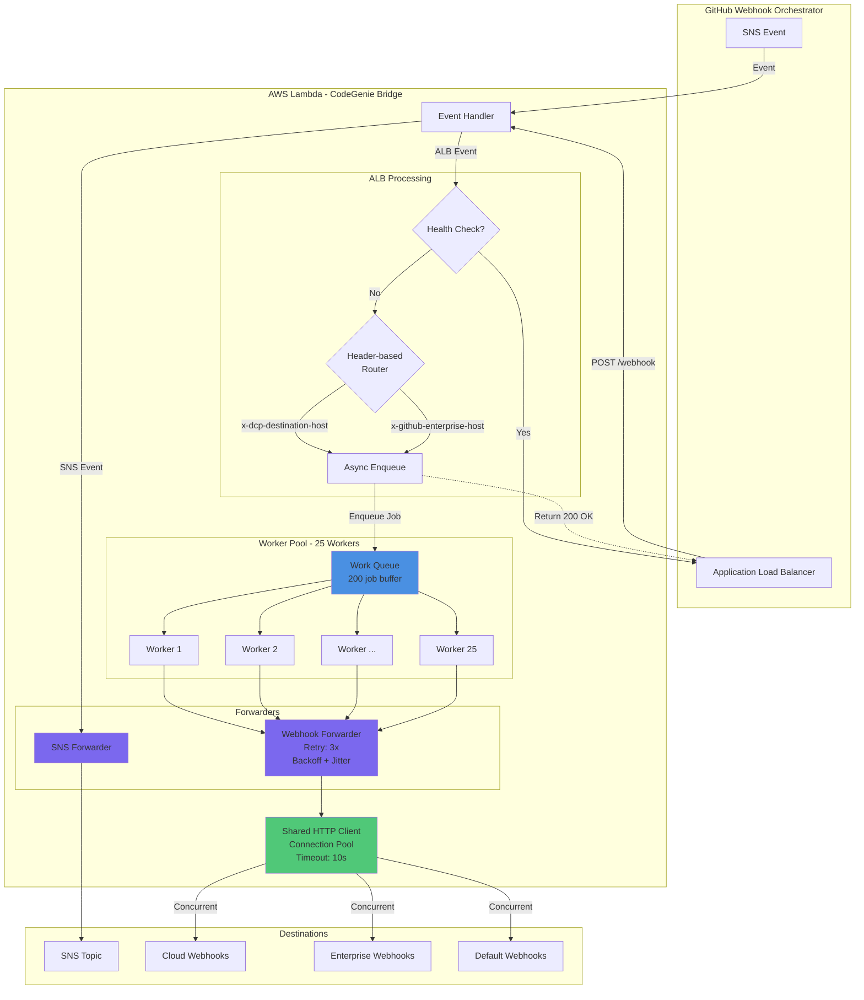

<div align="center">
  <h1>🌉 Lambda Bridge</h1>
  <p>High-performance AWS Lambda function for ALB-to-SNS/Webhook event forwarding</p>

  [](https://go.dev)
  [](https://aws.amazon.com/lambda/)
  [](https://aws.amazon.com/ec2/graviton/)
  [](https://github.com/Dannytrev21/lambda-bridge)
  [](https://github.com/Dannytrev21/lambda-bridge)
</div>

## Table of Contents
- [Overview](#overview)
- [Features](#features)
- [Architecture](#architecture)
- [Prerequisites](#prerequisites)
- [Installation](#installation)
- [Configuration](#configuration)
- [Usage](#usage)
- [Development](#development)
- [Testing](#testing)
- [Deployment](#deployment)
- [Performance](#performance)
- [Troubleshooting](#troubleshooting)
- [Contributing](#contributing)
- [Support](#support)

## Overview

Lambda Bridge is a high-performance AWS Lambda function designed to handle event forwarding from Application Load Balancers (ALB) to multiple destinations including SNS topics and webhooks. Built for scale, it processes over 200,000 messages per hour with sub-second latency while maintaining cost efficiency.

### Why Lambda Bridge?

Traditional event forwarding solutions often struggle with:
- **Scale**: Handling burst traffic and high throughput
- **Cost**: Running dedicated infrastructure for simple forwarding
- **Reliability**: Managing failures and retries gracefully
- **Simplicity**: Complex configurations for basic routing

Lambda Bridge solves these challenges by leveraging serverless architecture with intelligent routing and connection pooling.

### Key Features

- ⚡ **High Performance**: Processes 55+ messages/second with minimal latency
- 🔄 **Smart Routing**: Route events to SNS topics or multiple webhooks based on configuration
- 💪 **Resilient**: Built-in retry logic with exponential backoff and jitter
- 📊 **Worker Pool**: Concurrent processing with 25 workers and 200-job queue
- 🛡️ **Safe Defaults**: Always returns 200 to ALB to prevent retry storms
- 📦 **Zero Dependencies**: Minimal external dependencies for faster cold starts
- 🔍 **Observable**: Structured logging with request tracking

### Tech Stack

- **Language**: Go 1.21+ (chosen for performance and minimal memory footprint)
- **Runtime**: AWS Lambda with ARM64 architecture (Graviton2)
- **Event Sources**: Application Load Balancer (ALB), SNS
- **Destinations**: SNS topics, HTTP/HTTPS webhooks
- **Configuration**: YAML-based environment configs

## Architecture



### Architecture Overview

Lambda Bridge uses a **worker pool pattern** for high-throughput webhook forwarding while maintaining safe ALB responses.

**Key Design Decisions:**

1. **Immediate ALB Response (200 OK)**: Prevents retry storms by always returning success, even before processing
2. **Async Processing**: Jobs are enqueued and processed by worker pool after ALB response
3. **Header-based Routing**: Routes to different webhook groups based on request headers
4. **Concurrent Webhook Delivery**: Each webhook URL is called concurrently in its own goroutine
5. **Retry with Backoff**: Failed webhooks retry up to 3 times with exponential backoff and ±25% jitter
6. **Connection Pooling**: Shared HTTP client reuses connections (100 idle, 10 per host)
7. **SNS Synchronous**: SNS events are forwarded synchronously and errors trigger Lambda retries

### Components

- **Event Handler**: Routes incoming events (ALB vs SNS), manages worker pool lifecycle
- **Worker Pool**: 25 goroutines processing jobs from a 200-capacity buffered channel
- **Webhook Forwarder**: Handles concurrent HTTP forwarding with retry logic
- **SNS Forwarder**: Publishes events to configured SNS topic
- **Config Loader**: Loads environment-specific YAML configurations from embedded files
- **HTTP Client**: Shared connection pool for all webhook requests (10s timeout)

## Prerequisites

- Go 1.21 or higher
- AWS CLI configured with appropriate permissions
- AWS Account with Lambda, SNS, and ALB access
- Make (for build automation)
- zip utility (for deployment packaging)

## Installation

### Quick Start

```bash
# Clone the repository
git clone https://github.com/Dannytrev21/lambda-bridge.git
cd lambda-bridge

# Install dependencies
go mod download

# Run tests
make test

# Build for Lambda
make lambda-build
```

### Local Development

```bash
# Set up environment
export ENV=dev
export SNS_TOPIC_ARN="arn:aws:sns:us-east-1:123456789012:your-topic"

# Run tests with coverage
make test-coverage

# Run benchmarks
make test-bench

# Format code
make fmt
```

## Configuration

Lambda Bridge uses environment-specific YAML configuration files located in `configs/`:

### Environment Variables

| Variable | Description | Default | Required |
|----------|-------------|---------|----------|
| `ENV` or `ENVIRONMENT` | Environment (dev/qa/prod) | `dev` | No |
| `SNS_TOPIC_ARN` | Target SNS topic ARN | - | Yes |
| `WEBHOOK_URLS` | Comma-separated webhook URLs | - | No |
| `CLOUD_WEBHOOK_URLS` | Cloud-specific webhook URLs | - | No |
| `ENTERPRISE_WEBHOOK_URLS` | Enterprise webhook URLs | - | No |
| `DEBUG` | Enable debug logging (true/false) | `false` | No |

### Configuration Files

Example `configs/config-prod.yml`:

```yaml
sns_topic_arn: "arn:aws:sns:us-east-1:123456789012:lambda-bridge-prod"
debug: false
cloud_webhook_urls:
  - "https://api.example.com/webhooks/primary"
  - "https://api.example.com/webhooks/secondary"
enterprise_webhook_urls:
  - "https://enterprise.example.com/webhook"
webhook_urls:
  - "https://default.example.com/webhook"
```

### Configuration Parameters

- **sns_topic_arn**: SNS topic ARN for event forwarding
- **debug**: Enable debug logging (true/false)
- **cloud_webhook_urls**: List of webhook URLs for cloud destinations (selected via `x-dcp-destination-host` header)
- **enterprise_webhook_urls**: List of webhook URLs for enterprise destinations (selected via `x-github-enterprise-host` header)
- **webhook_urls**: Default webhook URLs when no specific routing header is present

### Hardcoded Settings

The following settings are currently hardcoded and cannot be changed via configuration:

- **Worker Count**: 25 concurrent workers
- **Queue Size**: 200-job buffer
- **Max Retries**: 3 retry attempts with exponential backoff
- **Retry Delays**: 100ms base delay, 5s max delay
- **Jitter**: ±25% randomization on retry delays (always enabled)
- **Webhook Timeout**: 10 seconds per HTTP request

## Usage

### Lambda Function Configuration

1. **Create Lambda Function**:
```bash
aws lambda create-function \
  --function-name lambda-bridge \
  --runtime provided.al2 \
  --architectures arm64 \
  --role arn:aws:iam::account:role/lambda-role \
  --handler bootstrap \
  --zip-file fileb://lambda-deployment-arm64.zip \
  --environment Variables={ENV=prod} \
  --timeout 30 \
  --memory-size 512
```

2. **Configure ALB Target**:
```bash
# Register Lambda with ALB target group
aws elbv2 register-targets \
  --target-group-arn arn:aws:elasticloadbalancing:region:account:targetgroup/name \
  --targets Id=arn:aws:lambda:region:account:function:lambda-bridge
```

### Event Formats

#### ALB Event
```json
{
  "requestContext": {
    "elb": {
      "targetGroupArn": "arn:aws:elasticloadbalancing:..."
    }
  },
  "httpMethod": "POST",
  "path": "/webhook",
  "headers": {
    "content-type": "application/json"
  },
  "body": "{\"message\":\"Hello World\"}"
}
```

#### SNS Event
```json
{
  "Records": [{
    "Sns": {
      "Message": "{\"data\":\"example\"}",
      "TopicArn": "arn:aws:sns:region:account:topic"
    }
  }]
}
```

## Development

### Project Structure

```
lambda-bridge/
├── cmd/                  # Application entry points
│   └── main.go          # Lambda handler main
├── internal/            # Private application code
│   ├── config/         # Configuration loading
│   ├── forwarder/      # SNS and webhook forwarding logic
│   └── handler/        # Lambda event handling
├── configs/             # Environment configurations
│   ├── config-dev.yml
│   ├── config-qa.yml
│   └── config-prod.yml
├── test/                # Integration tests
├── features/            # BDD test scenarios
└── scripts/             # Build and deployment scripts
```

### Available Commands

```bash
make help          # Show all available commands
make build         # Build Lambda binary (ARM64)
make test          # Run unit tests
make test-coverage # Generate coverage report
make test-bench    # Run performance benchmarks
make lambda-build  # Create deployment package
make clean         # Clean build artifacts
make fmt           # Format Go code
```

### Testing

```bash
# Run all tests
make test

# Run with coverage
make test-coverage
# View HTML report: open coverage.html

# Run specific package tests
go test -v ./internal/handler

# Run benchmarks
make test-bench

# Run BDD tests
go test ./features -v
```

### Code Quality

The project uses standard Go tooling:

```bash
# Format code
go fmt ./...

# Lint code
golangci-lint run

# Security scan
gosec ./...
```

## Deployment

### AWS Lambda Deployment

#### Manual Deployment

```bash
# Build deployment package
make lambda-build

# Update function code
aws lambda update-function-code \
  --function-name lambda-bridge \
  --zip-file fileb://lambda-deployment-arm64.zip

# Update environment variables
aws lambda update-function-configuration \
  --function-name lambda-bridge \
  --environment Variables={ENV=prod,SNS_TOPIC_ARN=arn:aws:sns:region:account:topic}
```

#### CI/CD Pipeline

```yaml
# Example GitHub Actions workflow
name: Deploy
on:
  push:
    branches: [main]
jobs:
  deploy:
    runs-on: ubuntu-latest
    steps:
      - uses: actions/checkout@v2
      - uses: actions/setup-go@v2
      - run: make lambda-build
      - run: aws lambda update-function-code ...
```

### Monitoring & Observability

Configure CloudWatch for monitoring:

```bash
# Create log group
aws logs create-log-group \
  --log-group-name /aws/lambda/lambda-bridge

# Set retention
aws logs put-retention-policy \
  --log-group-name /aws/lambda/lambda-bridge \
  --retention-in-days 7
```

### Recommended Lambda Settings

- **Memory**: 512 MB (optimal for performance/cost)
- **Timeout**: 30 seconds
- **Reserved Concurrency**: 100 (adjust based on load)
- **Architecture**: ARM64 (Graviton2)
- **Runtime**: provided.al2

## Performance

### Benchmarks

Lambda Bridge is optimized for high throughput and low latency:

- **Throughput**: 200,000+ messages/hour (55+ msgs/sec)
- **Latency**: P50 < 50ms, P99 < 200ms
- **Cold Start**: < 100ms (ARM64 with minimal dependencies)
- **Memory Usage**: ~50MB baseline, ~200MB under load
- **Concurrent Connections**: 100+ webhook endpoints

Run benchmarks:
```bash
make test-bench
```

**Note**: Performance characteristics are currently hardcoded. To optimize for different workloads, you'll need to modify the constants in the source code (see `internal/handler/handler.go` and `internal/forwarder/forwarder.go`).

## Troubleshooting

### Common Issues

**Lambda Timeout**
- **Symptom**: Function times out after 30 seconds
- **Solution**: Check webhook endpoints are responding. The webhook timeout is hardcoded to 10s - if you need faster responses, you'll need to modify `internal/forwarder/forwarder.go`

**High Error Rate**
- **Symptom**: CloudWatch shows errors in logs
- **Solution**: Verify webhook URLs are accessible and responding. Check logs for specific error messages. The system will automatically retry failed requests up to 3 times with exponential backoff

**Memory Exceeded**
- **Symptom**: "Runtime exited with error: signal: killed"
- **Solution**: Increase Lambda memory allocation. The current configuration uses 25 workers with a 200-job queue which may need adjustment for higher loads

**SNS Publish Failures**
- **Symptom**: "AccessDenied" errors
- **Solution**: Verify Lambda IAM role has `sns:Publish` permission for the configured SNS topic

**Queue Full Warnings**
- **Symptom**: "Queue full - dropping job" in logs
- **Solution**: The 200-job buffer is exceeded. This indicates sustained burst traffic beyond capacity. Consider increasing queue size in `internal/handler/handler.go`

### Debug Mode

Enable debug logging in configuration:
```yaml
debug: true
```

View logs:
```bash
aws logs tail /aws/lambda/lambda-bridge --follow
```

### Health Checks

Lambda Bridge automatically skips ALB health check requests:
- Paths: `/health`, `/status`, or `/ping`
- User-Agent containing: `elb-healthchecker` (case-insensitive)
- Returns: 200 OK immediately without forwarding to webhooks

## Contributing

We welcome contributions! Please follow these guidelines:

1. Fork the repository
2. Create a feature branch (`git checkout -b feature/amazing-feature`)
3. Write tests for new functionality
4. Ensure all tests pass (`make test`)
5. Format code (`make fmt`)
6. Commit changes (`git commit -m 'feat: add amazing feature'`)
7. Push to branch (`git push origin feature/amazing-feature`)
8. Open a Pull Request

### Development Guidelines

- Follow standard Go conventions
- Write unit tests (minimum 80% coverage)
- Use meaningful commit messages (conventional commits)
- Update documentation for new features
- Add benchmarks for performance-critical code

## Support

- 📧 **Email**: support@example.com
- 🐛 **Issues**: [GitHub Issues](https://github.com/Dannytrev21/lambda-bridge/issues)
- 📚 **Documentation**: [Wiki](https://github.com/Dannytrev21/lambda-bridge/wiki)
- 💬 **Discussions**: [GitHub Discussions](https://github.com/Dannytrev21/lambda-bridge/discussions)

---

<div align="center">
  Built with ❤️ using Go and AWS Lambda

  [](https://github.com/Dannytrev21/lambda-bridge)
</div>